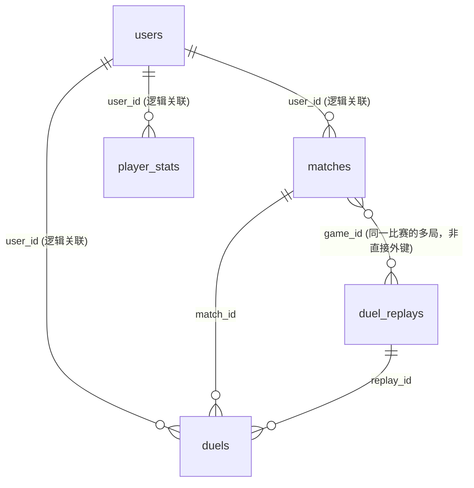

# RFC: 怀旧服天梯卡组与卡片多维统计系统设计方案

> **文件标识**：`docs/deck-statistics-system-plan.md`  
> **状态**：`DESIGN (首期仅 1109；Match 对阵采用月度先后攻单行汇总，待样本验收)`
> **创建日期**：2026-09-23  
> **适用范围**：`Nostalgia-duel-server` 的 YGOPro `1109` 排位统计；`1103` 决斗服务维持现状，统计扩展另行规划

---

## 1. 概述与目标

### 1.1 背景
为了完善怀旧服的数据生态并为玩家提供竞技环境参考，本方案拟提供以下统计看板：
1. **卡组 Match 对抗矩阵**（每类卡组对其他类别的先攻、后攻与综合 Match 场数/胜场；按月、每天凌晨重建）；
2. **卡片与卡组使用率统计**（怪兽/魔法/陷阱/额外/Side，含 1/2/3 张投入量分布）；
3. **卡组胜率详情与高胜率玩家榜单（Top 10）**；
4. **玩家战绩卡组透视与双方初始卡组（.ydk）下载**；
5. **对战录像列表支持按卡组类型筛选与初始卡组导出**。

### 1.2 核心设计理念与非目标
* **OLTP 与 OLAP 明确分离**：实时对局结算路径必须极轻，严禁在对局结束事务中进行多表大范围扫描或实时全量聚合；
* **控制数据增长**：每个有效玩家 Match 最多保存一份卡组快照，不展开逐卡明细行；汇总表可重建；
* **对阵只存一次事实**：一条汇总行表示一种“先攻卡组 → 后攻卡组”，不设 `deck_a/deck_b`、反向玩家视角行、`ALL` 行或预存胜率；小局统计若将来需要，另行设计，不混入 Match 行；
* **单一事实来源**：卡组快照跟着玩家视角的 `matches` 行走；小局先后手跟着 `duels` 行走；赛制、赛季及对手卡组类型通过关联得出；
* **原生线协议与录像兼容**：**绝不魔改 `.yrp` 录像二进制结构**，确保所有主流 YGOPro 客户端（PC/手机端）能 100% 正常播放录像；
* **严格遵循 DDD 与六边形架构**：业务实体在领域层封闭，持久化与 HTTP 暴露位于适配层。

---

## 2. 现有系统现状与表关系剖析

当前系统的排位对局持久化采用了**“单人视角行（Per-user Row）”**模式：



图中的 `user_id`、`match_id`、`replay_id` 和 `game_id` 连线表示查询时的逻辑关联；初始迁移并未给这些列建立外键，不能按数据库已保证参照完整性设计回溯。

1. **`matches` 表**：完整持久化的 1v1 Match 写入 **2 条记录**（双方各 1 条，共享 `game_id`），分别记录本玩家的 `winner`、`player_score` 与 `opponent_score`；现有写入逻辑在用户档案查不到时会跳过该玩家，统计必须防御单边记录；
2. **`duels` 表**：完整持久化的小局（G1/G2/G3）通常写入 **2 条记录**（双方各 1 条），记录本局的 `result` 与 `turns`；`match_id` 目前是字符串列，初始迁移未声明指向 `matches.id` 的数据库外键；
3. **`duel_replays` 表**：有录像的小局存 **1 条记录**，内含二进制录像 `replay_data`（`.yrp`），供双方的 `duels.replay_id` 共同指向；断线判负等路径可能写入没有对应录像的 `duels.replay_id`，不可将其视为有效外键；
4. **现状痛点**：当前数据库未保存初始卡组，也未显式记录小局先后手。`.yrp` 保存卡组与响应，但不直接保存 `MSG_START` 消息流。

---

## 3. 目标数据模型与架构设计

### 分类规则的现有来源

同级分析仓库 `Nostalgia-duel-server-analysis` 的 [`deck_analysis.py`](../../Nostalgia-duel-server-analysis/deck_analysis.py)（基线提交 `c9ba01c535600d94090df0d6a45a57af4b6feaef`）已有供 1109 离线分析使用的分类器；[`analyze_online_g1.py`](../../Nostalgia-duel-server-analysis/analyze_online_g1.py) 从 G1 录像提取卡组、读取固定 `cards.cdb` 的 `datas.alias`，并以该分类器生成报表。它定义 **25 个具名类别 +「其他」**，而非本计划原先假设的 32 个模板；这些规则属于分析代码，正式服务需在本仓库内逐条移植并固定版本，不依赖邻近仓库的运行时文件、Python 环境或其生产数据库连接。邻近仓库的 README 类别数与源码不一致，以源码和回归样本为准。

该分析仓库本机 `output/summary.json` 是一次 1109 历史样本：735 场有效 Match 中 733 场有且成功解析 G1 录像；1466 个玩家卡组视角中 1391 个被归为具名类别（94.884%），659/733 场双方均为具名类别（89.9045%）。这是**分类覆盖率样本，不是准确率证明**。`output/` 被该仓库 `.gitignore` 排除，不能把这些数字当作可复现的 CI 金样本或固定发布门槛；应以纳入版本控制的匿名固定样本验证分类一致性。`unknown_decks.csv` 仅用于人工复核「其他」的高频指纹；不得把其内容或读取生产库的脚本作为服务运行时资源。

### 3.1 全局实体关系图 (Target ERD)

```mermaid
erDiagram
    deck_types ||--o{ match_decks : "classified_as"
    
    matches ||--o| match_decks : "match_id (每条玩家视角行至多 1 份)"
    matches ||--o{ duels : "match_id"
    
    duel_replays ||--o{ duels : "replay_id"
    
    match_decks ..> stats_card_usage : "batch aggregation"
    match_decks ..> stats_deck_usage : "batch aggregation"
    match_decks ..> stats_deck_matchups : "batch aggregation"
```

---

### 3.2 关键设计决策论证

#### 决策一：卡组快照为什么跟着 `match` 走，而不是跟着 `duel` 走？
1. **符合游戏王 MATCH 赛制本质**：在一场三局两胜（BO3）的 Match 中，选手的卡池总量（40~60 主卡 + 15 额外 + 15 副卡组）在开局时即锁定，卡组核心轴不会因 G2/G3 的换 Side 而改变；
2. **消灭统计权重偏差（Weighting Bias）**：若按小局统计卡片投入率，拖入 G3 的比赛会导致其卡片被重复计算 3 次，而 2:0 的比赛只计算 2 次。按 Match 维度统计是竞技比赛分析的标准口径；
3. **避免重复快照**：无需在每一小局重复存储相同的卡片数组。初始快照必须在 G1 开始前、换 Side 前冻结；结算时读取当前 `client.deck` 会读到 G2/G3 的修改版。

#### 决策二：`duels` 表加了先后手，`matches` 表为什么不需要加先后手？
1. **定义重合**：所谓“Match 先攻”，在竞技游戏王中定义即为“G1（第一小局）先攻”；
2. **单一事实来源**：`duels` 补充 `duel_index` 和可空的 `is_first` 后，`matches JOIN duels ON duel_index = 1` 可得 G1 已知先后手；缺少 G1 或无法确认座次的历史 Match 保持未知，不得当成后攻。

#### 决策三：卡片使用率为什么采用“定时预聚合”而非“卡片明细表”？
1. **避免数据行数爆炸**：10 万场对局若展开成明细表将产生 250 万~ 300 万行；定时聚合只需维护数百张常用卡片的结果；
2. **有界批处理**：按稳定游标分批读取卡组并累加，批量大小与内存上限通过压测确定，不承诺未经测量的处理耗时；
3. **解决卡片类型判定难题**：卡片是怪兽、魔法还是陷阱，直接查内存常驻的 `cards.cdb`，免去复杂的 SQL 跨库/跨引擎关联。

---

### 3.3 数据库模式规格 (Schema Specifications)

以下是**目标 PostgreSQL 结构**，不是已经执行的迁移。月度键 `month_key` 是北京时间 `YYYYMM` 整数，与现有 `matches.season` 相同；首期所有月度汇总只写 `1109`。`updated_at` 是整批重建的发布时间，由任务显式写入相同值。计数用 `bigint`；胜率由查询层根据胜场/场数计算，不存浮点结果。已有 `matches`、`duels`、`duel_replays` 不重建，后文只列新增列和索引。

| 表 | 每行代表什么 | 主键/唯一粒度 |
| :--- | :--- | :--- |
| `deck_types` | 一种固定 1109 卡组类别的展示元数据 | `code` |
| `match_decks` | 某玩家在一场 Match 的 G1 前初始卡组 | `match_id` |
| `stats_deck_usage` | 某月某类卡组出现的玩家视角次数 | 月份 + 类别 |
| `stats_deck_coverage` | 某月卡组使用量与对阵统计的分母/缺口 | 月份 |
| `stats_deck_matchups` | 某月某类先攻卡组对某类后攻卡组的物理 Match 结果 | 月份 + 先攻类别 + 后攻类别 |
| `stats_usage_coverage` | 某窗口某卡槽的卡片使用率分母 | 窗口 + 卡槽 |
| `stats_card_usage` | 某窗口某卡槽某卡的投入次数分布 | 窗口 + 卡槽 + 卡片 |

#### 事实与分类表

```sql
CREATE TABLE deck_types (
    code varchar(64) PRIMARY KEY,
    name_zh varchar(64) NOT NULL,
    sort_order integer NOT NULL UNIQUE CHECK (sort_order >= 0)
);

CREATE TABLE match_decks (
    match_id varchar PRIMARY KEY REFERENCES matches(id),
    deck_type_code varchar(64) NOT NULL REFERENCES deck_types(code),
    classifier_version varchar(64) NOT NULL,
    snapshot_source varchar(16) NOT NULL
        CHECK (snapshot_source IN ('online', 'replay_backfill')),
    main_cards integer[] NOT NULL CHECK (cardinality(main_cards) BETWEEN 40 AND 60),
    extra_cards integer[] NOT NULL CHECK (cardinality(extra_cards) BETWEEN 0 AND 15),
    side_cards integer[] NULL CHECK (side_cards IS NULL OR cardinality(side_cards) BETWEEN 0 AND 15)
);

CREATE INDEX idx_match_decks_type_match ON match_decks (deck_type_code, match_id);
```

`deck_types` 只存 1109 的 25 个具名类别（`D01`–`D25`）和 `OTHERS`，`sort_order` 按来源 `SUPPORTED_CATEGORIES` 固定；代码与名称发布后不得重排或复用。没有细类→大类映射，不建 `group_id`。分类规则仍是随代码发布的有序谓词，不建 `deck_templates`：分析仓库的阈值、集合合计、不同种类数和布尔分支无法无损表示为卡片 ID 数组。`classifier_version` 同时标识规则顺序、类别映射与 alias 策略；重分类后必须重建受影响汇总。

`match_decks.match_id` 对应一条**玩家视角**的 `matches.id`，每行至多一份初始快照。`deck_type_code` 是该玩家的分类，`OTHERS` 表示已分类但未命中具名规则，快照不存在才是“未知”。`main_cards`、`extra_cards`、`side_cards` 保留原始卡片 ID 和重复张数，以便导出 `.ydk`；历史 G1 录像无法恢复 Side 时必须为 `NULL`，不能用空数组冒充。卡片 ID 存在性、禁限与整副卡组合法性由固定 1109 资源和应用服务验证，数组长度检查不是全部合法性校验。`game_id`、`user_id`、`format_id`、`season`、比赛时间均从 `matches` 关联，不在快照表复制。

#### 月度卡组使用量及覆盖率

```sql
CREATE TABLE stats_deck_usage (
    format_id varchar(16) NOT NULL CHECK (format_id = '1109'),
    month_key integer NOT NULL CHECK (month_key >= 200001 AND month_key % 100 BETWEEN 1 AND 12),
    deck_type_code varchar(64) NOT NULL REFERENCES deck_types(code),
    deck_count bigint NOT NULL CHECK (deck_count > 0),
    updated_at timestamptz NOT NULL,
    PRIMARY KEY (format_id, month_key, deck_type_code)
);

CREATE TABLE stats_deck_coverage (
    format_id varchar(16) NOT NULL CHECK (format_id = '1109'),
    month_key integer NOT NULL CHECK (month_key >= 200001 AND month_key % 100 BETWEEN 1 AND 12),
    all_decks bigint NOT NULL CHECK (all_decks >= 0),
    valid_decks bigint NOT NULL CHECK (valid_decks >= 0 AND valid_decks <= all_decks),
    named_decks bigint NOT NULL CHECK (named_decks >= 0 AND named_decks <= valid_decks),
    paired_matches bigint NOT NULL CHECK (paired_matches >= 0),
    seat_known_matches bigint NOT NULL CHECK (seat_known_matches >= 0 AND seat_known_matches <= paired_matches),
    updated_at timestamptz NOT NULL,
    PRIMARY KEY (format_id, month_key)
);

ALTER TABLE stats_deck_usage ADD CONSTRAINT fk_stats_deck_usage_coverage
    FOREIGN KEY (format_id, month_key)
    REFERENCES stats_deck_coverage (format_id, month_key);
```

`stats_deck_usage` 每类每月一行，`deck_count` 是有效 `matches` 玩家视角行中有可信快照的次数；一场 A 对 B 各贡献 1，A 内战对 A 贡献 2。`OTHERS` 也计入。零次类别不插行，页面将 `deck_types` 左连接为 0。`stats_deck_coverage` 每月**总有一行**（空月也是 0）：`all_decks` 是有效玩家视角行数，`valid_decks` 是其中有可信分类快照的行数，`named_decks` 再排除 `OTHERS`；`paired_matches` 是具有两个有效视角、结果互补、快照齐全且赛制一致的物理 Match 数，`seat_known_matches` 是其中 G1 真实存在且先后手已确认为一真一假的 Match 数。跨表核算须满足 `COALESCE(SUM(stats_deck_usage.deck_count), 0) = valid_decks`、具名类别之和等于 `named_decks`。使用率是 `deck_count / valid_decks`；分类覆盖率是 `named_decks / valid_decks`，两者分母不可混用。

#### 月度 Match 对阵汇总：只存先攻方→后攻方

```sql
CREATE TABLE stats_deck_matchups (
    format_id varchar(16) NOT NULL CHECK (format_id = '1109'),
    month_key integer NOT NULL CHECK (month_key >= 200001 AND month_key % 100 BETWEEN 1 AND 12),
    first_deck_code varchar(64) NOT NULL REFERENCES deck_types(code),
    second_deck_code varchar(64) NOT NULL REFERENCES deck_types(code),
    match_count bigint NOT NULL CHECK (match_count > 0),
    first_wins bigint NOT NULL CHECK (first_wins >= 0 AND first_wins <= match_count),
    updated_at timestamptz NOT NULL,
    PRIMARY KEY (format_id, month_key, first_deck_code, second_deck_code),
    FOREIGN KEY (format_id, month_key)
        REFERENCES stats_deck_coverage (format_id, month_key)
);

CREATE INDEX idx_stats_deck_matchups_second
    ON stats_deck_matchups (format_id, month_key, second_deck_code, first_deck_code);
```

一行就是“该月 `first_deck_code` 在 G1 先攻、`second_deck_code` 在 G1 后攻”的**物理 Match** 数量及先攻玩家胜场。`second_wins = match_count - first_wins`，所以不另存后攻胜场。无 `deck_a/deck_b`、无反向玩家视角行、无 `ALL` 行、无胜率列；`(A,B)` 与 `(B,A)` 是**不同先后攻条件**，各自对应真实比赛，不是重复存储。同类内战 `(A,A)` 一场只计 `match_count=1`，`first_wins` 只记录该场先攻玩家是否胜利。`OTHERS` 作为真实类别参与存储，页面可选择只展示 25 个具名类别；这样“全部对手”可由所有真实类别求和，不会把隐藏类别漏出分母。跨表核算须满足当月 `COALESCE(SUM(match_count), 0) = stats_deck_coverage.seat_known_matches`。

例如某月代行天使（`D01`）先攻对水泡英雄（`D25`）50 场、代行赢 30 场，存 `(D01, D25, 50, 30)`；水泡英雄先攻对代行 20 场、水泡英雄赢 12 场，存 `(D25, D01, 20, 12)`。代行先攻胜率为 `30/50`，后攻胜率为 `(20-12)/20 = 8/20`，综合胜率为 `(30+8)/(50+20) = 38/70`。先攻查询筛 `first_deck_code`，后攻查询筛 `second_deck_code`；最终按原始计数加总后相除，不平均两个百分比。分母为 0 时返回 `null`。

#### 卡片使用量及其分母

```sql
CREATE TABLE stats_usage_coverage (
    format_id varchar(16) NOT NULL CHECK (format_id = '1109'),
    period_type varchar(16) NOT NULL CHECK (period_type IN ('today', 'week', 'month', 'all')),
    period_key varchar(32) NOT NULL,
    metric varchar(16) NOT NULL CHECK (metric IN ('monster', 'spell', 'trap', 'extra', 'side')),
    all_decks bigint NOT NULL CHECK (all_decks >= 0),
    valid_decks bigint NOT NULL CHECK (valid_decks >= 0 AND valid_decks <= all_decks),
    updated_at timestamptz NOT NULL,
    PRIMARY KEY (format_id, period_type, period_key, metric)
);

CREATE TABLE stats_card_usage (
    format_id varchar(16) NOT NULL CHECK (format_id = '1109'),
    period_type varchar(16) NOT NULL CHECK (period_type IN ('today', 'week', 'month', 'all')),
    period_key varchar(32) NOT NULL,
    metric varchar(16) NOT NULL CHECK (metric IN ('monster', 'spell', 'trap', 'extra', 'side')),
    card_id integer NOT NULL CHECK (card_id > 0),
    deck_count bigint NOT NULL CHECK (deck_count > 0),
    copies_1 bigint NOT NULL CHECK (copies_1 >= 0),
    copies_2 bigint NOT NULL CHECK (copies_2 >= 0),
    copies_3 bigint NOT NULL CHECK (copies_3 >= 0),
    updated_at timestamptz NOT NULL,
    PRIMARY KEY (format_id, period_type, period_key, metric, card_id),
    FOREIGN KEY (format_id, period_type, period_key, metric)
        REFERENCES stats_usage_coverage (format_id, period_type, period_key, metric),
    CHECK (copies_1 + copies_2 + copies_3 = deck_count)
);
```

`period_key`：`today=YYYYMMDD`、`week=YYYY-Www`、`month=YYYYMM`、`all=all`，由应用层验证格式与北京时间窗口；月度卡片统计的 `period_key` 必须等于 `matches.season` 的十进制表示。`stats_usage_coverage` 每窗口/卡槽即使没有卡也保留 0 分母行；`stats_card_usage` 只存至少出现一次的 alias 归一卡片 ID。`monster/spell/trap` 只统计 Main，`extra` 只统计 Extra，`side` 只统计 Side；Side 未知的历史快照不进 `side.valid_decks`。每份卡组每张归一卡在相应卡槽只贡献一次 `deck_count`，其张数恰好落在一个 `copies_1/2/3` 桶中。`usage_rate = deck_count / stats_usage_coverage.valid_decks` 现算，不存冗余率；卡片名称与类型从固定 CDB 取得，不复制到 PostgreSQL。

#### 现有表只做增量变更

```sql
ALTER TABLE duels ADD COLUMN duel_index smallint NULL;
ALTER TABLE duels ADD COLUMN is_first boolean NULL;
ALTER TABLE duels ADD CONSTRAINT ck_duels_duel_index
    CHECK (duel_index IS NULL OR duel_index BETWEEN 1 AND 3);

CREATE UNIQUE INDEX uq_duels_active_match_index
    ON duels (match_id, duel_index)
    WHERE duel_index IS NOT NULL AND deleted_at IS NULL;
CREATE INDEX idx_matches_active_format_season_game
    ON matches (format_id, season, game_id)
    WHERE deleted_at IS NULL AND anulled = false;
```

`duels.duel_index` 是该玩家的 G1/G2/G3，`is_first` 是**该小局**真实先攻；两列对历史行均可空，绝不设置 `DEFAULT false`。新 1109 写入须赋值，只有来源可靠的历史行才回填。`duel_replays` 已有 `(game_id, duel_index)` 唯一约束，但无录像判负局可能只有占位 `replay_id`，不能以非空 UUID 判断真实录像。`matches` 继续提供月份、双方胜负与软删/撤销状态；既有表无 `user_id`/`match_id`/`replay_id` 的完整数据库外键，历史配对仍需在聚合时校验。所有模式变更通过新 TypeORM 实体及**新生成迁移**实施，不能手改已应用迁移；新增索引最终以隔离数据库的查询计划确认。

现有源表中本功能依赖的列：`matches(id varchar PK, game_id uuid, user_id varchar, format_id varchar, best_of integer, season integer, date timestamp, winner boolean, player_score integer, opponent_score integer, anulled boolean, deleted_at timestamp)`；`duels(id varchar PK, match_id varchar, game_id uuid, replay_id uuid, deleted_at timestamp)` 加上上述两列；`duel_replays(id uuid PK, game_id uuid, duel_index smallint, format_id varchar, replay_data bytea)`。`duel_replays` 原有 `(game_id, duel_index)` 唯一约束、`matches` 原有 `(game_id, user_id)` 唯一约束仍保留。这里只列统计所需列，不改变其他现有字段。

---

## 4. 业务计算与处理流程

### 4.1 卡组识别核心算法（有序规则）

以分析仓库 `deck_analysis.py::classify_deck` 为 1109 行为基线，移植到本仓库领域层并保持可读的显式规则，**不使用**“核心卡 ID 子集匹配”代替原有判定。输入是 G1 前冻结、已通过 1109 固定禁限表验证的初始 **Main**；Extra 与 Side 随快照保存、用于使用率与下载，但不参与当前分类。

1. 根据固定 `cards.cdb` 的 `datas.alias` 把 Main 卡片 ID 沿 alias 链归一为原卡 ID，按归一 ID 计数；需要处理不存在的 alias 与环，原始卡片 ID 仍保留在 `match_decks` 供 `.ydk` 导出。
2. 按来源代码的规则**声明顺序**逐项判断，第一条命中即为结果；不可改成“命中核心卡最多”“priority 最小”或数据库返回顺序。例如代行天使要求两个固定 ID 各至少 1 张，再满足另一 ID 至少 1 张或备选 ID 至少 2 张；HB 要求两个 ID 各至少 2 张再命中候选集合；黑羽要求指定集合至少 3 种、合计至少 6 张；削血有 `OR` 分支。混沌均位于后段，避免压过更具体的命中。规则涉及 `count`、`total`、`distinct`、`AND`/`OR`，单个 `card_ids` 数组无法表达。
3. 未命中任一规则时返回「其他」；`evidence` 只是来源代码用于展示的命中卡 ID 子集，不保证完整表达该规则的全部条件。若线上需要解释原因，应基于规则 ID、版本与快照重算，不能把 evidence 当作独立判定事实。
4. 规则变更须显式提升 `classifier_version`，保留历史版本规则以复算旧快照。版本化对象同时包含类别代码/名称、规则顺序、卡片集合、阈值与 alias 归一策略；分类与历史回溯必须复用同一领域服务。

来源的 25 类为：代行天使、HB、导游兔、血代齿轮、龙骑兵团、废二、暗黑界、天狗植物、熔岩、混沌均、光道、蛙帝、废铁、永火、X剑士、遗式、守墓、黑羽、剑斗兽、六武众、变形斗士、科技属、削血、机巧、水泡英雄。`SUPPORTED_CATEGORIES` 是展示顺序，`rules` 才是命中优先顺序，不能混用。本期仅对 1109 固定 whitelist 与真实合法卡组样本验收这些规则。**声明 25 类不等于 25 类都可命中**：例如「蛙帝」规则必需 `20663556`，但 1109 whitelist 对该卡规定 0 张；来源样本中该类也是 0 次。首版为来源兼容保留其代码和零样本展示，M0 记录所有类似不可达分支，不因零样本擅自改写规则。

---

### 4.2 Match 对阵的逐场归并与查询口径

批处理先按 `game_id` 找出**恰好两条**有效的 1109 排位 `matches` 玩家视角行；两行必须属于不同玩家、`season`/`format_id`/赛制一致、`winner` 一真一假、比分互补，均非撤销或软删，并且各有目标版本的可信 `match_decks` 快照。异常的单边或多行配对只记录错误及覆盖率，不猜对手、不写对阵。月度使用量仍按有效单个玩家视角快照计算，因此它与对阵总场数的样本集可能不同，不能用“使用量÷2”替代物理 Match 数。

对每个配对 Match，再关联双方 `duels` 中 `duel_index=1` 且未软删的玩家视角行及对应真实 `duel_replays`；校验 `game_id`、`match_id`、`replay_id` 与 `is_first` 一真一假，确认哪一方为 G1 先攻。座次未知、G1 缺失或占位录像的场次不进入本期对阵表，也不被默认为后攻；但仍可进入卡组使用量，`paired_matches - seat_known_matches` 明示损失。只有 Match 最终有明确胜负才计入；无决结果不计，判负场次是否存在真实 G1 以 M0 的固定事件样本核定。

每个合格物理 Match 只向对应 `(month_key, first_deck_code, second_deck_code)` 加 `match_count=1`，若 G1 先攻玩家最终赢得 Match 则另加 `first_wins=1`。**Match 先后攻固定为 G1 座次**，G2/G3 换边不改变此行。查询某类别 X 对类别 Y：

| 查询 | 汇总行 | 场数 | X 胜场 |
| :--- | :--- | :--- | :--- |
| X 先攻对 Y | `(X, Y)` | `match_count` | `first_wins` |
| X 后攻对 Y | `(Y, X)` | `match_count` | `match_count - first_wins` |
| X 综合对 Y | 上面两行之和 | 两行 `match_count` 之和 | 两种 X 胜场之和 |

显示“对全部对手”时，对相应代码出现在 `first_deck_code` 或 `second_deck_code` 的行按以上规则加总，**包含 `OTHERS`**；不存在预先存好的 `ALL` 行。同类内战 `(X,X)` 每场物理 Match 只存一次，展示“X 对 X”的玩家视角综合战绩时展开成两个样本：`total=2*match_count`、`wins=match_count`；先攻和后攻各为 `match_count` 个样本，胜场分别为 `first_wins` 与 `match_count-first_wins`。整个月合格对阵的 `SUM(match_count)` 必须等于 `seat_known_matches`。胜率始终先加胜场与场数、再做 `wins/total`，`total=0` 返回 `null`；不采用离线报表将先/后攻两个百分比做算术平均的算法。

本期**不建 Game/Main/Side 对阵汇总**，也不把每局先后手混入 Match 表。`duels.is_first` 和 `duel_index` 仍保留真实小局事实，供 G1 座次确认和将来独立的小局统计变更使用。

### 4.3 定时聚合流（Cron Pipeline）
1. **窗口与频次**：卡组使用量和 Match 对阵只按北京时间月度统计，直接使用 `matches.season`。北京时间每天凌晨重建**当前月及刚结束的上月**；被历史回溯、撤销/软删或重分类影响的更早月份另行排队重建。卡片使用量仍支持 `today`（`YYYYMMDD`）、`week`（`YYYY-Www`）、`month`（`YYYYMM`）、`all` 四个窗口；日/周使用左闭右开北京时间边界，M0 先核对无时区 `matches.date` 的写入语义与 `season`，不一致时先修正再启用日/周。卡片的当前日可每 15 分钟、当前周每小时、月/全量每天凌晨刷新；接口公开每个汇总的 `updatedAt`。
2. **计算流程**：
   * 从有效 `matches` 关联 `match_decks`，按 `(matches.date, matches.id)` 游标有界读取；赛制和赛季来自 `matches`，不得从快照重复字段读取；
   * 先用固定 `cards.cdb` 的 alias 将同一卡片不同画码归一，原始 ID 只用于快照与 `.ydk`；每份卡组每个卡槽的每个归一 ID 只贡献一次 `deck_count`，投入张数按归一后的总数落入 `copies_1/2/3` 的一个桶。若归一后超出合法 1–3 张，标记脏数据而不静默丢弃；断言三桶之和等于 `deck_count`；
   * `monster/spell/trap` 只看 Main，`extra` 只看 Extra，`side` 只看 Side（不再按卡片类型拆 Side）。通过该环境固定 `cards.cdb` 的 Type 掩码校验卡槽，不可跨环境读资源；
   * Main/Extra 指标可纳入已验证的历史部分快照；Side 的 `valid_decks` 仅包含 `side_cards IS NOT NULL` 的完整快照。每个指标使用自己的 `valid_decks` 分母；`all_decks` 为该窗口有效玩家 Match 行数，覆盖率允许小于 100%；
   * 月度任务从同一批原始事实构建 `stats_deck_usage`、`stats_deck_coverage`、`stats_deck_matchups`、月度 `stats_card_usage` 与 `stats_usage_coverage`；在单一一致性快照内计算，拿 PostgreSQL advisory lock，校验各表计数等式后，在一个事务中按外键顺序替换该月旧行并提交。日/周/全量卡片窗口单独重建；空窗口也写 0 覆盖率行，不留下过期结果；
   * 对迟到结算、撤销/软删及回溯记录相应窗口为待刷新；离线全量可重建所有汇总。重分类前先将相关 `match_decks.classifier_version` 更新到目标版本，不能静默混合不兼容版本。接口延迟与任务内存/耗时以真实数据压测后设预算，不预设 `<1ms`。

---

## 5. 历史数据清洗与回溯 (Backfill Plan)

### 5.1 数据源与可提取范围
* **源数据表**：仅 1109 的 `matches`、`duels` 与 `duel_replays.replay_data`（二进制 `.yrp` 录像），以分析仓库 `analyze_online_g1.py` 的完整双视角 Match 过滤作候选集，再按本计划的异常和软删规则校验。
* **可尝试恢复的字段**：
  * 有效 G1 `.yrp` 内含两位玩家当局的 Main 与 Extra；需校验双方名字与 `matches` 两行的映射、非 TAG 模式、卡组大小及卡片 ID。乱序洗牌不影响卡片多重集合；缺 G1、坏录像或身份映射不唯一则跳过该场，不猜测卡组。
  * `duel_replays.duel_index` 已记录小局编号。`.yrp` 的 host/client 顺序可能反映当前局玩家顺序，但必须用仓库生成的已知座次样本证明它与真实先攻的关系，再允许把它映射回 `duels.is_first`；无法证明或映射歧义的旧行保持 `NULL`。
  * 胜负与回合数已经存于 `duels`；无需从录像重复推算。
* **物理边界与限制**：
  * 本仓库使用的 `ygopro-yrp-encode` 写入 Main、Extra 和响应，不写入 Side，也不写入 `MSG_START` 流。历史初始 Side 无法可靠恢复，`side_cards=NULL`；不得通过后续 G2/G3 的换入卡推断完整 Side，更不得宣称可恢复完整 `.ydk`。
  * 对于历史数据，`is_first` 的可回溯比例在真实样本验证前未知；回溯报告分别列出“完整 G1 快照”“座次已确认”“未知 Side”“解析失败”的场数。

### 5.2 回溯执行流水线 (Backfill Pipeline)
```text
[读取未处理的历史 matches & duel_replays]
                 │ (按 game_id 稳定游标分批，限制录像字节/批)
                 ▼
[解析 G1 录像 (.yrp)] ──> 使用已有 ygopro-yrp-encode 解码
                 │
                 ├──> 校验双方身份并提取 Main & Extra；Side 标记未知
                 └──> 调用同一版本的有序规则分类器判定 deck_type_code
                 │
                 ▼
[按 duel_replays.duel_index 关联各局]
                 └──> 仅在已验证录像玩家顺序与双方身份时确认 is_first
                 │
                 ▼
[批量事务写入/更新]
                 ├──> INSERT INTO match_decks (按 match_id 幂等写入双方快照)
                 └──> UPDATE duels SET is_first = ..., duel_index = ... (仅更新已确认值)
                 │
                 ▼
[触发首轮全量聚合] ──> 生成历史月度卡组/对阵及卡片汇总数据
```

先以只读 dry-run 运行一小批真实历史记录，抽样核对原始录像与两条玩家视角行的对应关系；仓库固定二进制样本的预期解析结果须人工核对，不能由同一个被测编码器即时生成。记录错误原因与覆盖率后再写入。回溯不得覆盖 `snapshot_source=online` 的完整卡组，也不得用未知值覆盖已确认的 `is_first`。事务以一场 `game_id` 为最小一致性单位，失败可重试；同一用户/同一 `replay_id` 的重复行必须被报告并跳过。完成后核对每场最多两份快照、每个有录像的小局最多两个互补座次，并重建受影响窗口。历史回溯和新在线结算可能并发，需先上线在线采集与可空迁移，再启动离线回溯。

---

## 6. HTTP API 接口契约规范

所有新增统计接口显式带 `:format`（本期只接受 `1109`），沿用现有 `RateLimitMiddleware` 和 `ranking.enabled` 开关；卡组使用量/对阵仅接受 `period=month&month=YYYYMM`，卡片使用量可用 `today|week|month|all`。分页参数限制为正整数，`pageSize <= 100`；返回窗口起止、`updatedAt`、样本数与覆盖率，空分母胜率为 `null`。不支持的统计格式/日期返回 400，统计关闭返回 503；已有 1103 排行榜、录像 API 不受影响。具体路径以现有 `/api/leaderboards/:format`、`/api/replays/:format` 的风格为准。

### 6.1 `GET /api/ladder/:format/deck-stats`
* **参数**：`period=month&month=YYYYMM`（如 `202609`）
* **说明**：获取月度 1109 Match 对抗矩阵。API 将单行物理 Match 汇总按“本方类别→对手类别”展开为先攻、后攻、综合计数，便于页面展示；反向视图只在响应中生成，数据库不存第二份。
* **返回示例**：
```json
{
  "monthKey": "202609",
  "coverage": { "pairedMatches": 70, "seatKnownMatches": 70 },
  "decks": [
    { "code": "D01", "nameZh": "代行天使" },
    { "code": "D25", "nameZh": "水泡英雄" }
  ],
  "stats": {
    "D01::D25": {
      "matches": 70, "matchWins": 38,
      "firstMatches": 50, "firstWins": 30,
      "secondMatches": 20, "secondWins": 8
    },
    "D25::D01": {
      "matches": 70, "matchWins": 32,
      "firstMatches": 20, "firstWins": 12,
      "secondMatches": 50, "secondWins": 20
    }
  }
}
```

示例数值只用于说明形状。每个单元始终返回上述 6 个原始计数；0 场单元可由前端填 0。若页面需要 `D01::ALL`，服务端从包含 `OTHERS` 的真实对手单元求和后返回相同 6 字段，绝不从数据表读取预存的 `ALL` 行。同类内战按第 4.2 节展开两个玩家视角后再生成 API 单元。

### 6.2 `GET /api/ladder/:format/usage/decks`
* **参数**：`period=month&month=YYYYMM&page=1&pageSize=20`
* **说明**：获取卡组使用率榜单。
* **返回**：各类别的使用数量与占比，读取 `stats_deck_usage` 与 `stats_deck_coverage`，含 `coverage: { allDecks, validDecks, namedDecks, pairedMatches, seatKnownMatches }`。`validDecks` 是有可信 Main/Extra、且已按发布规则分类的玩家 Match 快照数；`namedDecks` 排除 `OTHERS`。`OTHERS` 是有效分类，不等于缺失快照。使用率按 `deckCount / validDecks` 计算，不能用对阵表求分母。

### 6.3 `GET /api/ladder/:format/usage/cards`
* **参数**：`metric=monster|spell|trap|extra|side&period=month&month=YYYYMM&page=1&pageSize=20`
* **说明**：获取卡片使用率与 1/2/3 张投入分布。
* **返回**：
```json
{
  "total": 200,
  "coverage": { "allDecks": 10658, "validCardDecks": 9146 },
  "cards": [
    {
      "rank": 1,
      "cardId": 71413901,
      "name": "魔导战士 破坏者",
      "deckCount": 2410,
      "usageRate": 0.2635,
      "copies1": 264,
      "copies2": 1183,
      "copies3": 963
    }
  ]
}
```

卡片名称从本应用固定的 `cards.cdb`/既有卡片查询能力获取，不引入外部浮动资源；卡名缺失时保留卡片 ID。`cardId` 为 alias 归一后的原卡 ID，原始画码仍可从公开 `.ydk` 查看。`usageRate = deckCount / validCardDecks`，返回值按需要格式化但不改变原始计数。

### 6.4 `GET /api/ladder/:format/deck-detail`
* **参数**：`deckTypeCode=D01&period=month&month=YYYYMM`
* **说明**：卡组胜率详情页，由月度对阵表派生该类别对各类别（含 `OTHERS`）的先攻、后攻、综合 Match 战绩；Top 10 玩家榜单仅使用同一批 `seat_known_matches` 中该类别的玩家视角行，达到 25 场才入榜。榜单按胜率降序、样本数降序、用户 ID 升序稳定排序；匿名展示规则与现有排行榜一致，不在新接口泄露被遮蔽的用户 ID。

### 6.5 `GET /api/ladder/:format/matches/:matchId/deck`
* **公开范围**：所有人均可下载双方已记录的初始卡组，无登录或管理员 API Key 要求；与现有公开录像下载一样使用 `RateLimitMiddleware`。页面和接口须明确告知玩家：在线保存的 Main、Extra、Side 会对所有访问者公开。
* **参数与响应**：`:matchId` 为玩家视角 `matches.id`；响应为 `text/plain; charset=utf-8` 的标准 `.ydk`，包含 `#main`、`#extra`、`!side`，并设置安全的 `Content-Disposition` 文件名。对手下载需传对手的玩家视角 `matchId`，服务端验证两行属于同一 `game_id`，不得仅凭客户端 `side` 字符串决定对象。赛制不符、撤销/软删、快照不存在时返回 404。
* **历史部分快照**：所有下载响应设置 `X-Deck-Completeness: complete|partial`；`side_cards=NULL` 时可以导出 Main/Extra，但文件名须标记 `partial`，页面不得把空的 `!side` 段解释成原始副卡组为空。

### 6.6 现有 `GET /api/replays/:format` 扩展
* 仅对 1109 录像列表增加 `deckTypeCode` 筛选与类别/分类状态展示，基于 `duel_replays.game_id` 关联双方玩家视角快照；同一录像只返回一次，过滤时明确“任一方命中”语义。卡组快照不存在时展示“未知”，不可归为 `OTHERS`。现有 `.yrp` 下载端点与字节内容保持不变；初始卡组导出走 6.5 的独立公开下载接口。

---

## 7. 实施里程碑计划 (Implementation Milestones)

| 阶段 | 任务内容 | 交付产物 |
| :--- | :--- | :--- |
| **M0: 1109 样本与目录** | 用仓库生成的 1109 真实 `.yrp` 与历史样本验证 G1 身份映射、先攻顺序及 Side 缺失；按分析仓库提交 `c9ba01c` 核对 25 类、`D01`–`D25` 映射、别名表、规则顺序和基线覆盖率 | 固定二进制样本及人工期望值、不可重排的 1109 类别代码清单、覆盖率与未知样本复核记录 |
| **M1: 模式变更** | 在 `evolution-types` 新增第 3.3 节的 7 张表及迁移；旧 `duels` 字段先可空；执行 `npm run migration:generate --name=...`、审阅迁移并在隔离数据库验证 | 不含通用模板表的最小模式、可空小局字段、约束与索引，不改已应用迁移 |
| **M2: 分类器与初始卡组冻结** | 将分析仓库的 25 条有序谓词逐条移植到 TypeScript 领域服务，使用固定 CDB 的 alias 归一；G1 前冻结已经验证的三卡槽快照和每局座次 | `DeckClassifier`、来源 25 类样本的逐项对照测试、规则优先级/阈值/别名/「其他」边界测试及领域事件快照契约 |
| **M3: 1109 在线持久化** | 仅为 1109 排位在现有 `RankedMatchPersistenceService` 单事务内写入快照与小局座次；保留按 `game_id` 去重和一次重试语义，解决缺录像小局 | 1109 真实排位冒烟、重复事件/失败重试测试、可查询的一对双方快照；1103 现有结算回归 |
| **M4: 1109 历史回溯** | dry-run 后按 `game_id` 有界批处理并输出错误台账；在线与离线调用同一版本分类器，仅写入可信字段 | 可断点重跑脚本、1109 覆盖率、与同批只读分析输出的可解释差异、匿名固定样本和抽样人工核对及回滚方式 |
| **M5: 1109 周期聚合** | 每天凌晨按月重建卡组使用量、覆盖率与 Match 先攻→后攻对阵，并按各窗口重建卡片使用量；窗口级原子替换和多实例互斥；启动时显式注册统计任务，不借 Socket 构造函数副作用 | 可重建汇总表、撤销/迟到数据刷新机制、内战与反向查询用例、数据量压测 |
| **M6: 1109 HTTP 与页面** | 统计接口、1109 录像列表筛选、公开卡组导出及对应页面入口 | 明确的 JSON/下载契约、分页与公开访问/无效快照测试、1109 页面联调 |

每个阶段先写会失败的同目录测试，再实现最小功能；不为纯文档阶段补无意义测试。上线顺序是可空迁移 → 1109 在线采集 → 1109 历史回溯 → 汇总构建 → 查询页面，避免回溯期间新比赛持续缺失。回滚应用时保留新增表与可空列，不删已采集事实；汇总可重建。若下线统计功能，关闭调度与 HTTP 展示即可。发布前执行 `npm run lint`、`npm run test`、`npm run check:nostalgia-resources`、`npm run build`，再以 1109 真实排位冒烟核对数据库事实和原生 `.yrp` 下载字节一致；全量测试继续保护现有 1103 决斗能力。

已生成的 `openspec/changes/add-1109-deck-statistics` 仍描述旧的 12 维/玩家视角汇总模式；**实施前必须将其 design、specs 与 tasks 同步为本节结构和 Match 口径**。本计划更新本身不代表这些 OpenSpec 制品已同步。

---

## 8. AI 评审核对清单 (Review Checklist for AI Agents)

请审阅本方案的 AI Agent 重点核查以下要点：
1. **数据一致性**：每个 `match_id` 至多一个快照；同一 `game_id` 双方配对正确，每个合格物理 Match 只写一条先攻→后攻计数；反向查询和内战展开后的分母可由原始行复算；未知先后手不当作后攻。
2. **并发与时序**：初始卡组在 G1 前冻结，G2/G3 换 Side 不影响它；重复结束事件、事务失败重试及多实例汇总不会重复计数。在线事务耗时以生产相近数据测量，超过预算时优化而非承诺固定 `<2ms`。
3. **录像兼容**：`.yrp` 与现有下载原始字节一致；历史 `.yrp` 无 Side 与 `MSG_START` 的边界反映在覆盖率中。
4. **回溯幂等**：重复运行只补可信缺口，不覆盖完整在线快照；损坏/缺失录像有原因分类及人工抽样；不生成假的完整 `.ydk`。
5. **查询与公开下载**：使用 `EXPLAIN (ANALYZE, BUFFERS)` 验证主要窗口查询和分页索引；撤销、软删、迟到比赛使汇总更新；无需凭据即可下载双方有效快照，历史 Side 未知有明确标识，统计与下载响应不额外暴露用户 ID。
