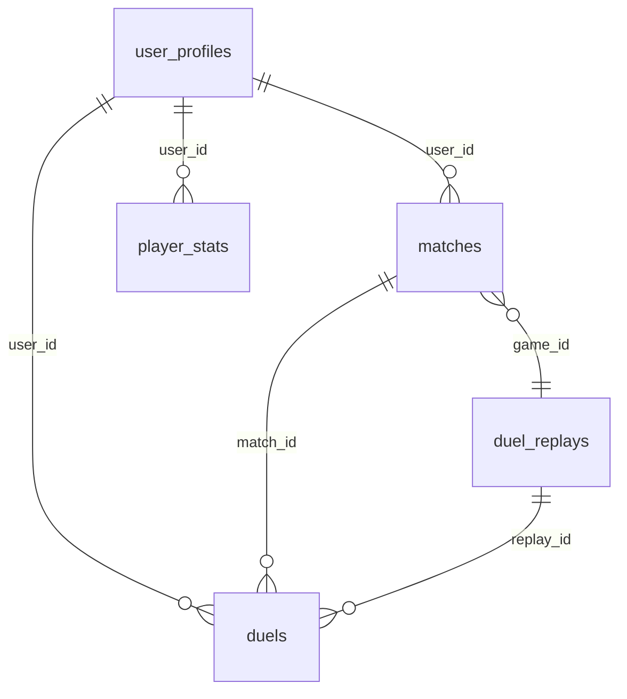

# RFC: 怀旧服天梯卡组与卡片多维统计系统设计方案

> **文件标识**：`docs/deck-statistics-system-plan.md`  
> **状态**：`PROPOSED (待AI Agent与研发评审)`  
> **创建日期**：2026-09-23  
> **适用范围**：`Nostalgia-duel-server`（YGOPro 1103/1109 怀旧服）

---

## 1. 概述与目标

### 1.1 背景
为了完善怀旧服的数据生态并为玩家提供竞技环境参考，本方案旨在复刻类似成熟怀旧服务器（如 `121.4.34.71:7922`）的全套卡组与卡片统计看板：
1. **卡组对抗 12 维胜率矩阵**（Match / Game / Main / Side × 综合 / 先攻 / 后攻）；
2. **卡片与卡组使用率统计**（怪兽/魔法/陷阱/额外/Side，含 1/2/3 张投入量分布）；
3. **卡组胜率详情与高胜率玩家榜单（Top 10）**；
4. **玩家战绩卡组透视与双方初始卡组（.ydk）下载**；
5. **对战录像列表支持按卡组类型筛选与初始卡组导出**。

### 1.2 核心设计理念与非目标
* **OLTP 与 OLAP 明确分离**：实时对局结算路径必须极轻，严禁在对局结束事务中进行多表大范围扫描或实时全量聚合；
* **杜绝数据膨胀（Zero Bloat）**：不创建千万级别的卡片明细行，利用批处理与定时预聚合；
* **单一事实来源与零冗余**：卡组快照跟着 Match 走；小局先后手跟着 Duel 走；推导数据不重复建字段；
* **原生线协议与录像兼容**：**绝不魔改 `.yrp` 录像二进制结构**，确保所有主流 YGOPro 客户端（PC/手机端）能 100% 正常播放录像；
* **严格遵循 DDD 与六边形架构**：业务实体在领域层封闭，持久化与 HTTP 暴露位于适配层。

---

## 2. 现有系统现状与表关系剖析

当前系统的排位对局持久化采用了**“单人视角行（Per-user Row）”**模式：



1. **`matches` 表**：一场 1v1 的 Match 会写入 **2 条记录**（双方各 1 条，共享 `game_id`），分别记录本玩家的 `winner`（是否获胜）、`player_score` 与 `opponent_score`；
2. **`duels` 表**：每一小局（G1/G2/G3）同样写入 **2 条记录**（双方各 1 条），记录本局的 `result`（`winner`/`loser`/`deuce`）、`turns`，外键绑定各自的 `match_id`；
3. **`duel_replays` 表**：客观事实视角，每一小局仅存 **1 条记录**，内含二进制录像 `replay_data`（`.yrp`），供双方的 `duels.replay_id` 共同指向；
4. **现状痛点**：当前数据库未记录玩家使用了何种卡组，且未显式记录小局的先后手（先后手数据只藏在 `.yrp` 的二进制流中）。

---

## 3. 目标数据模型与架构设计

### 3.1 全局实体关系图 (Target ERD)

```mermaid
erDiagram
    deck_types ||--o{ deck_templates : "has templates"
    deck_types ||--o{ match_decks : "classified_as"
    
    matches ||--o{ match_decks : "match_id (1 match has 2 player decks)"
    matches ||--o{ duels : "match_id"
    
    duel_replays ||--o{ duels : "replay_id"
    
    match_decks ..> stats_card_usage : "cron ETL aggregation"
```

---

### 3.2 关键设计决策论证

#### 决策一：卡组快照为什么跟着 `match` 走，而不是跟着 `duel` 走？
1. **符合游戏王 MATCH 赛制本质**：在一场三局两胜（BO3）的 Match 中，选手的卡池总量（40~60 主卡 + 15 额外 + 15 副卡组）在开局时即锁定，卡组核心轴不会因 G2/G3 的换 Side 而改变；
2. **消灭统计权重偏差（Weighting Bias）**：若按小局统计卡片投入率，拖入 G3 的比赛会导致其卡片被重复计算 3 次，而 2:0 的比赛只计算 2 次。按 Match 维度统计是竞技比赛分析的标准口径；
3. **存储空间缩减 65%**：无需在每一小局重复存储相同的卡片数组。

#### 决策二：`duels` 表加了先后手，`matches` 表为什么不需要加先后手？
1. **定义重合**：所谓“Match 先攻”，在竞技游戏王中定义即为“G1（第一小局）先攻”；
2. **单一事实来源**：`duels` 补充 `duel_index` 和 `is_first` 后，`matches JOIN duels ON duel_index = 1` 即可天然得出 Match 先后手，无需在 `matches` 冗余维护，彻底避免双写不一致。

#### 决策三：卡片使用率为什么采用“定时预聚合”而非“卡片明细表”？
1. **避免数据行数爆炸**：10 万场对局若展开成明细表将产生 250 万~ 300 万行；定时聚合只需维护数百张常用卡片的结果；
2. **内存批处理速度极快**：Node.js 在内存中遍历 1 万套卡组（40万个数字）做 Map 统计仅需 30~50ms；
3. **解决卡片类型判定难题**：卡片是怪兽、魔法还是陷阱，直接查内存常驻的 `cards.cdb`，免去复杂的 SQL 跨库/跨引擎关联。

---

### 3.3 数据库模式规格 (Schema Specifications)

#### 表 1：`deck_types`（卡组分类定义表）
| 字段名 | 类型 | 约束 | 描述 |
| :--- | :--- | :--- | :--- |
| `id` | `integer` | PK | 卡组细分类 ID（如 258 代行, 514 兔beat, 770 荒行六武, 4095 其他） |
| `code` | `varchar(64)` | UNIQUE, NOT NULL | 英文大写唯一标识（如 `AGENT`, `RABBIT_BEAT`, `OTHERS`） |
| `group_id` | `varchar(64)` | NOT NULL, INDEX | 归属大类标识（如 `agent_group`, `hero_group`） |
| `names` | `jsonb` | NOT NULL | 多语言名称：`{"zh": "代行", "ja": "代行", "en": "Agent", "ko": "대행"}` |
| `sort_order` | `integer` | DEFAULT 0 | 排序权重 |
| `is_active` | `boolean` | DEFAULT true | 是否启用 |

#### 表 2：`deck_templates`（卡组识别核心轴规则表）
| 字段名 | 类型 | 约束 | 描述 |
| :--- | :--- | :--- | :--- |
| `id` | `uuid` | PK | 主键 |
| `deck_type_id` | `integer` | FK -> deck_types.id, INDEX | 归属的细分类 ID |
| `filename` | `varchar(128)` | NOT NULL | 模板文件名（如 `258_1.ydk`） |
| `card_ids` | `integer[]` | NOT NULL | 核心必带卡片密码数组（子集匹配规则） |
| `created_at` | `timestamptz` | DEFAULT now() | 创建时间 |

#### 表 3：`match_decks`（比赛卡组快照表 - 核心事实表）
| 字段名 | 类型 | 约束 | 描述 |
| :--- | :--- | :--- | :--- |
| `id` | `uuid` | PK | 主键 |
| `match_id` | `varchar(64)` | FK -> matches.id, UNIQUE | 关联玩家该场 Match 记录 |
| `game_id` | `uuid` | NOT NULL, INDEX | 全局比赛唯一 ID（与对手共享） |
| `user_id` | `varchar(64)` | NOT NULL, INDEX | 玩家用户 ID |
| `format_id` | `varchar(16)` | NOT NULL | 赛制（`1103` / `1109`） |
| `season` | `integer` | NOT NULL, INDEX | 赛季/月份（如 `202609`） |
| `deck_type_id` | `integer` | FK -> deck_types.id, INDEX | 识别出的本方卡组类型 ID |
| `opponent_deck_type_id` | `integer` | FK -> deck_types.id, INDEX | 识别出的对手卡组类型 ID（冗余以加速矩阵计算） |
| `main_cards` | `integer[]` | NOT NULL | 初始主卡组卡片密码列表 |
| `extra_cards` | `integer[]` | NOT NULL | 初始额外卡组卡片密码列表 |
| `side_cards` | `integer[]` | NOT NULL | 初始副卡组卡片密码列表 |
| `deck_buffer` | `bytea` | NOT NULL | 紧凑二进制卡组数据（供前端快速下载 `.ydk`） |
| `created_at` | `timestamptz` | NOT NULL, INDEX | 对局创建时间 |

#### 表 4：`stats_card_usage`（卡片使用率预聚合汇总表）
| 字段名 | 类型 | 约束 | 描述 |
| :--- | :--- | :--- | :--- |
| `id` | `bigserial` | PK | 主键 |
| `format_id` | `varchar(16)` | NOT NULL | 赛制（`1103` / `1109`） |
| `period_type` | `varchar(16)` | NOT NULL | 周期：`today` / `week` / `month` / `all` |
| `period_key` | `varchar(32)` | NOT NULL | 周期键（如 `202609`, `2026-W38`, `all`） |
| `metric` | `varchar(16)` | NOT NULL | 卡槽类型：`monster` / `spell` / `trap` / `extra` / `side` |
| `card_id` | `integer` | NOT NULL | 卡片密码 |
| `deck_count` | `integer` | NOT NULL | 采用该卡片的卡组总数 |
| `usage_rate` | `numeric(6,5)` | NOT NULL | 采用率（`deck_count / valid_decks`） |
| `copies_1` | `integer` | NOT NULL | 投入 1 张的卡组数 |
| `copies_2` | `integer` | NOT NULL | 投入 2 张的卡组数 |
| `copies_3` | `integer` | NOT NULL | 投入 3 张的卡组数 |
| `updated_at` | `timestamptz` | NOT NULL | 刷新时间 |

* **唯一约束**：`UNIQUE(format_id, period_type, period_key, metric, card_id)`

#### 现有表变更：[`duels`](file:///personal-vscode-project/Nostalgia-duel-server/src/evolution-types/src/entities/DuelResumeEntity.ts) 表
追加 2 个字段：
* `duel_index`: `smallint NOT NULL DEFAULT 1`（第几小局：1, 2, 3）
* `is_first`: `boolean NOT NULL DEFAULT false`（本局玩家是否先攻）
* **复合索引**：`CREATE INDEX "IDX_duels_match_duel_index" ON "duels" ("match_id", "duel_index");`

---

## 4. 业务计算与处理流程

### 4.1 卡组识别核心算法（Template Match）
* **输入**：对局开始前玩家提交的初始卡组（Main + Extra）。
* **判定步骤**：
  1. 将玩家卡组的 `main_cards` 和 `extra_cards` 合并为已投入集合 $S$；
  2. 遍历 `deck_templates` 中的规则：若模板的 `card_ids` 为 $S$ 的真子集（即玩家卡组包含了模板中的每一张核心卡），则判定命中；
  3. 若该卡组类型存在多个变体模板（如代行有 `258_1.ydk` 和 `258_2.ydk`），命中最先匹配者；
  4. 若遍历完毕未命中任何已知模板，统一判定为 `deck_type_id = 4095`（其他 / Others）。

---

### 4.2 12 维胜率矩阵推导逻辑

系统通过 `matches` 与 `duels` 的单人视角行天然实现胜率计算：

| 维度 | 指标名称 | 聚合源表与条件 | 胜场计数 (`wins`) | 总场计数 (`total`) |
| :--- | :--- | :--- | :--- | :--- |
| **Match** | 综合胜率 | `matches` | `winner = true` | 全部 Match |
| **Match** | 先攻胜率 | `matches m JOIN duels d (duel_index=1)` | `m.winner = true AND d.is_first = true` | `d.is_first = true` |
| **Match** | 后攻胜率 | `matches m JOIN duels d (duel_index=1)` | `m.winner = true AND d.is_first = false` | `d.is_first = false` |
| **Game** | 综合胜率 | `duels` | `result = 'winner'` | 全部 Duel |
| **Game** | 先攻胜率 | `duels` | `result = 'winner' AND is_first = true` | `is_first = true` |
| **Game** | 后攻胜率 | `duels` | `result = 'winner' AND is_first = false` | `is_first = false` |
| **Main (G1)** | 综合胜率 | `duels (duel_index = 1)` | `result = 'winner'` | `duel_index = 1` |
| **Main (G1)** | 先攻胜率 | `duels (duel_index = 1)` | `result = 'winner' AND is_first = true` | `duel_index = 1 AND is_first = true` |
| **Main (G1)** | 后攻胜率 | `duels (duel_index = 1)` | `result = 'winner' AND is_first = false` | `duel_index = 1 AND is_first = false` |
| **Side (G2/3)** | 综合胜率 | `duels (duel_index > 1)` | `result = 'winner'` | `duel_index > 1` |
| **Side (G2/3)** | 先攻胜率 | `duels (duel_index > 1)` | `result = 'winner' AND is_first = true` | `duel_index > 1 AND is_first = true` |
| **Side (G2/3)** | 后攻胜率 | `duels (duel_index > 1)` | `result = 'winner' AND is_first = false` | `duel_index > 1 AND is_first = false` |

* **胜率计算公式**：$\text{Win Rate} = \frac{\text{wins}}{\text{total}}$。
* **内战自平衡性**：在双视角行设计下，卡组 A vs 卡组 A 产生 2 条记录（1胜1负），胜率天然平衡为 50%，与目标服完全吻合。

---

### 4.3 卡片使用率定时聚合流（Cron Pipeline）
1. **触发频次**：
   * `today`：每 15 分钟增量计算；
   * `week` / `month`：每 1 小时重新计算；
   * `all`：每天凌晨离线重算一次。
2. **计算流程**：
   * 查询对应时间窗口内的 `match_decks`，获得总卡组样本数 $N$；
   * Node.js 内存批处理：遍历每套卡组，统计每张卡在主牌、额外、副牌的出现频次（`copies: 1 | 2 | 3`）；
   * 通过常驻内存的 `cards.cdb` 读取卡片 Type 掩码，标记为怪兽、魔法、陷阱、额外或 Side；
   * 排序出 Top 卡片列表，单事务批量 `UPSERT` 入库 `stats_card_usage`；
   * 前端请求接口直接以主键/唯一索引命中，响应耗时 `< 1ms`。

---

## 5. 历史数据清洗与回溯 (Backfill Plan)

### 5.1 数据源与可提取范围
* **源数据表**：`duel_replays.replay_data`（二进制 `.yrp` 录像）。
* **可 100% 还原的字段**：
  * G1 录像头部包含双方完整的初始 **Main（主卡组）** 与 **Extra（额外卡组）**；
  * 各局数据流的第一个操作消息 `MSG_START` 记录了当小局的先手玩家（`playerType`）；
  * 胜负关系与回合数。
* **物理边界与限制**：
  * 原生 `.yrp` 格式规范不序列化副卡组（Side Deck）。因此，历史对局中那些“在整个 Match 期间从未换上场过的沉底 Side 卡”无法还原。这与目标服的快照覆盖率特性完全一致（`validCardDecks / allDecks`）。

### 5.2 回溯执行流水线 (Backfill Pipeline)
```text
[读取未处理的历史 matches & duel_replays]
                 │ (按 game_id 分批，如每批 500 场 Match)
                 ▼
[解析 G1 录像 (.yrp)] ──> 使用 ygopro-yrp-encode 解码
                 │
                 ├──> 提取 Player 0 / Player 1 的 Main & Extra
                 └──> 运行模板分类算法判定 deck_type_id
                 │
                 ▼
[解析各局 MSG_START] ──> 确定 G1, G2, G3 每局的 is_first
                 │
                 ▼
[批量事务写入/更新]
                 ├──> INSERT INTO match_decks (写入双方初始卡组与分类)
                 └──> UPDATE duels SET is_first = ..., duel_index = ...
                 │
                 ▼
[触发首轮全量聚合] ──> 生成历史 stats_card_usage 汇总数据
```

---

## 6. HTTP API 接口契约规范

### 6.1 `GET /api/ladder-deck-stats`
* **参数**：`month=YYYYMM`（如 `202609`）
* **说明**：获取月度卡组大类对抗矩阵。
* **返回示例**：
```json
{
  "monthKey": "202609",
  "decks": [
    { "id": "agent_group", "name": { "zh": "代行", "en": "Agent" }, "members": [258, 260] },
    { "id": "beat_group", "name": { "zh": "兔beat", "en": "Dino Rabbit" }, "members": [514] }
  ],
  "stats": {
    "agent_group::beat_group": {
      "matches": 89, "matchWins": 34, "firstMatches": 42, "firstWins": 18, "secondMatches": 47, "secondWins": 16,
      "games": 222, "gameWins": 98, "firstGames": 111, "firstGameWins": 55, "secondGames": 111, "secondGameWins": 43,
      "mainGames": 89, "mainGameWins": 45, "mainFirstGames": 42, "mainFirstGameWins": 27, "mainSecondGames": 47, "mainSecondGameWins": 18,
      "sideGames": 133, "sideGameWins": 53, "sideFirstGames": 69, "sideFirstGameWins": 28, "sideSecondGames": 64, "sideSecondGameWins": 25
    },
    "agent_group::all": { ... }
  }
}
```

### 6.2 `GET /api/ladder/usage/decks`
* **参数**：`metric=deck&period=month&month=YYYYMM&page=1`
* **说明**：获取卡组使用率榜单。
* **返回**：各细分类卡组的使用数量与占比，含 `coverage: { allDecks, validCardDecks }`。

### 6.3 `GET /api/ladder/usage/cards`
* **参数**：`metric=monster|spell|trap|extra|side&period=month&month=YYYYMM&page=1`
* **说明**：获取卡片使用率与 1/2/3 张投入分布。
* **返回**：
```json
{
  "total": 200,
  "coverage": { "allDecks": 10658, "validCardDecks": 9146 },
  "cards": [
    {
      "rank": 1,
      "cardId": 71413901,
      "name": "魔导战士 破坏者",
      "deckCount": 2410,
      "usageRate": 0.2635,
      "copies1": 264,
      "copies2": 1183,
      "copies3": 963
    }
  ]
}
```

### 6.4 `GET /api/ladder/deck-detail`
* **参数**：`deckTypeId=258&period=month&month=YYYYMM`
* **说明**：卡组胜率详情页，展示对阵各细分类卡组的战绩及使用该卡组达到 25 场 Match 的 Top 10 胜率玩家。

### 6.5 `POST /api/ladder/player/deck`
* **参数**：`{ "matchId": "xxx", "side": "player" | "opponent" }`
* **说明**：从 `match_decks` 读取该场比赛对应选手的卡组快照，流式返回标准的 `.ydk` 文本文件供下载。

---

## 7. 实施里程碑计划 (Implementation Milestones)

| 阶段 | 任务内容 | 交付产物 |
| :--- | :--- | :--- |
| **M1: 模式变更** | 在 `evolution-types` 新增实体与迁移脚本 | `deck_types`, `deck_templates`, `match_decks`, `stats_card_usage` 实体与 Migration |
| **M2: 模板分类器** | 实现卡组子集匹配引擎与模板文件加载 | `DeckClassifier` 领域服务与单元测试，内置 32 种主流卡组模板 |
| **M3: 在线持久化** | 修改 `RankedMatchPersistenceService` | 决斗结算时写入 `match_decks` 并补齐 `duels.is_first` |
| **M4: 历史回溯脚本** | 编写离线 Backfill 迁移脚本 | `scripts/backfill-deck-stats.ts`，支持断点续跑与覆盖率校验 |
| **M5: 定时聚合任务** | 实现 Cron 调度与内存 Map-Reduce 统计 | 周期性刷新 `stats_card_usage` 的 Worker 模块 |
| **M6: HTTP 接口** | 实现 REST 控制器与查询服务 | 5 个标准 HTTP API 端点及自动化测试用例 |

---

## 8. AI 评审核对清单 (Review Checklist for AI Agents)

请审阅本方案的 AI Agent 重点核查以下要点：
1. **数据一致性**：`match_decks` 与 `matches` 严格通过 `match_id` 绑定，内战与非对称对抗的胜率分母与除法逻辑是否自洽？
2. **并发与时序**：在线结算事务在写入 `match_decks` 时是否耗时极短（< 2ms），且不影响现有的重试机制？
3. **协议隔离性**：`.yrp` 二进制录像文件是否严格保持原生结构未受任何污染？
4. **回溯幂等性**：历史回溯脚本重复运行时是否基于 `match_id` 安全幂等，不会插入重复快照？
5. **查询索引覆盖**：`duels(match_id, duel_index)` 与 `stats_card_usage` 唯一约束是否确保了高频统计查询命中索引？
