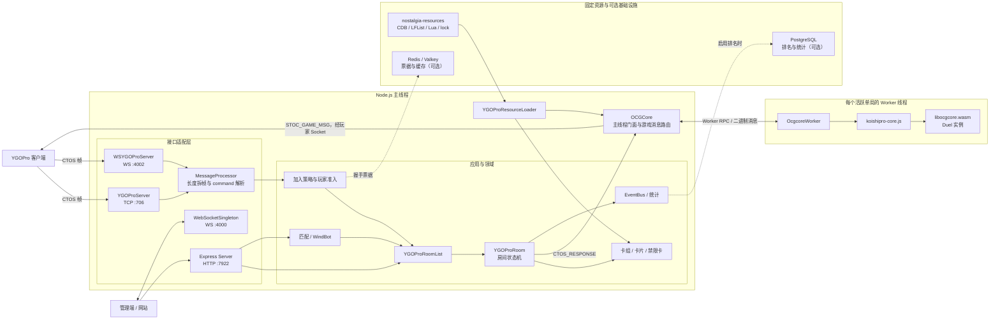

# 项目源码导航

本文用于快速熟悉 `Nostalgia-duel-server`。它不重复完整产品规格，只回答三个问题：项目从哪里启动、一次连接和决斗如何流转、修改某类功能应该先看哪里。

长期产品边界和开发约束仍以根目录的 [`AGENTS.md`](../AGENTS.md) 为准。

## 1. 项目定位

这是一个只支持 YGOPro 协议的怀旧决斗服务器，目前固定提供两个环境：

| 环境 | 房间标识 | 规则 | 对局制 | 卡池 ID 数量 |
| --- | --- | --- | --- | --- |
| 1103 | `1103#<roomId>` | OCG 2011.03、Master Rule 2 | MATCH，三局两胜 | 5197 |
| 1109 | `1109#<roomId>` | OCG 2011.09、Master Rule 2 | MATCH，三局两胜 | 5310 |

代码、CDB、禁限卡表、Lua 脚本和资源锁随同一个应用版本发布。运行时不会从上游下载或刷新资源。

## 2. 总体架构图



实线表示主要调用或消息流；虚线表示由配置启用的可选基础设施。WASM 不直接管理网络连接，客户端响应先进入房间状态，再由主线程 `OCGCore` 转交 Worker；WASM 的计算结果则由 `OCGCore` 生成不同玩家视角并写回原 Socket。

## 3. 建议阅读顺序

第一次读代码时，建议按下面顺序，不需要从目录树逐文件阅读。

| 顺序 | 文件 | 先理解什么 |
| --- | --- | --- |
| 1 | [`src/index.ts`](../src/index.ts) | 进程启动顺序和主要服务入口 |
| 2 | [`src/config/index.ts`](../src/config/index.ts) | 端口、Redis、Postgres、资源目录等配置来源 |
| 3 | [`src/socket-server/YGOProServer.ts`](../src/socket-server/YGOProServer.ts) | TCP 连接如何建立、分配 Socket ID 和接收数据 |
| 4 | [`src/shared/messages/MessageProcessor.ts`](../src/shared/messages/MessageProcessor.ts) | 二进制帧如何处理分片、粘包并读取 command |
| 5 | [`src/ygopro/room/application/YGOProJoinHandler.ts`](../src/ygopro/room/application/YGOProJoinHandler.ts) | `JoinGame` 如何进入加入策略 |
| 6 | [`src/ygopro/room/application/join-strategies/NostalgiaJoinStrategy.ts`](../src/ygopro/room/application/join-strategies/NostalgiaJoinStrategy.ts) | `1103#roomId` / `1109#roomId` 如何查找或创建房间 |
| 7 | [`src/ygopro/room/domain/YGOProRoom.ts`](../src/ygopro/room/domain/YGOProRoom.ts) | 房间聚合、玩家、观战者和状态切换 |
| 8 | [`src/ygopro/room/domain/states/YGOProDuelingState.ts`](../src/ygopro/room/domain/states/YGOProDuelingState.ts) | 对局期间客户端命令如何处理 |
| 9 | [`src/ygopro/ocgcore-worker/ocgcore.ts`](../src/ygopro/ocgcore-worker/ocgcore.ts) | 主线程如何驱动 Worker、路由核心消息 |
| 10 | [`src/ygopro/ocgcore-worker/ocgcore-worker.ts`](../src/ygopro/ocgcore-worker/ocgcore-worker.ts) | Worker 如何实例化 WASM Duel 并执行规则计算 |
| 11 | [`src/ygopro/ygopro/YGOProResourceLoader.ts`](../src/ygopro/ygopro/YGOProResourceLoader.ts) | CDB、Lua、LFList 和 WASM 如何加载 |

## 4. 目录职责

```text
src/
├── index.ts                 进程组合根和启动入口
├── bootstrap/              资源、持久化、统计、匹配的启动流程
├── config/                 环境变量解析
├── http-server/            Express 管理 API
├── socket-server/          YGOPro TCP 与 WebSocket 接入
├── web-socket-server/      站点实时 WebSocket 通知
├── ygopro/                 YGOPro 房间、协议、卡组、核心和匹配业务
├── shared/                 跨模块领域能力和基础设施
├── evolution-types/        TypeORM 实体、数据源和迁移
└── test-support/           测试 Mother、Mock 和 WASM 测试驱动

nostalgia-resources/
├── lock.json               固定资源摘要和数量基线
└── ygopro/
    ├── base/               唯一基础 CDB 与基础脚本
    └── formats/1103|1109/  环境 LFList 与覆盖脚本
```

`src/ygopro/` 是主要阅读区域，其中常用子目录如下：

| 目录 | 职责 |
| --- | --- |
| `room/domain/` | 房间聚合、房间状态、录像和赛制配置 |
| `room/application/` | 建房、加入、断线、清理等用例 |
| `room/infrastructure/` | 房间列表、消息仓库、格式资源适配器 |
| `messages/` | 握手阶段的客户端/服务端消息 |
| `ocgcore-worker/` | 主线程 OCGCore 门面和 WASM Worker |
| `middleware/` | WASM 游戏消息的服务端中间件 |
| `ygopro/` | 固定资源加载、卡片存储和资源校验 |
| `deck/`、`card/`、`ban-list/` | 卡组构造、卡片查询和禁限卡表 |
| `matchmaking/`、`windbot/` | 匹配队列和机器人接入 |

## 5. 启动链路

[`src/index.ts`](../src/index.ts) 的启动顺序是：

```text
校验并加载固定资源
    ↓
按配置连接 Postgres / Redis
    ↓
注册统计订阅
    ↓
启动 HTTP 管理 API 和站点 WebSocket
    ↓
初始化 WindBot 与匹配队列
    ↓
启动 YGOPro TCP 和 YGOPro WebSocket 监听
```

重要边界：资源锁校验发生在持久化连接和端口监听之前。资源缺失或摘要漂移时，进程应直接启动失败，不接受客户端连接。

主要监听器：

| 服务 | 入口 | 默认配置项 |
| --- | --- | --- |
| YGOPro TCP | `YGOProServer` | `YGOPRO_PORT`，通常为 706 |
| YGOPro WebSocket | `WSYGOProServer` | `YGOPRO_WEBSOCKET_PORT`，默认 4002 |
| 管理 HTTP API | `Server` | `HTTP_PORT`，通常为 7922 |
| 站点实时 WebSocket | `WebSocketSingleton` | `WEBSOCKET_PORT`，通常为 4000 |

## 6. TCP 连接与加入房间

TCP 连接建立后的主链路：

```text
net.Server connection
    ↓
TCPClientSocket（包装原始 net.Socket）
    ↓
分配随机 socket.id
    ↓
MessageEmitter
    ↓
MessageProcessor
    ↓
PlayerInfo / JoinGame 等握手命令处理器
    ↓
JoinStrategyRegistry
    ↓
NostalgiaJoinStrategy
    ↓
YGOProRoomList 查找或创建房间
```

环境房间使用 `format#roomId` 作为身份。`1103#1001` 和 `1109#1001` 是两个隔离房间；查找时使用组合后的 `admissionKey`，不能只使用裸 `roomId`。

加入房间后，同一条 Socket 由 [`YGOProClient`](../src/ygopro/client/domain/YGOProClient.ts) 保存。房间内消息还会经过：

```text
YGOProClient.onMessage()
    ↓
SimpleRoomMessageEmitter
    ↓
MessageProcessor
    ↓
room.emitRoomEvent(command, payload, client)
    ↓
当前 YGOProRoomState 中注册的处理器
```

## 7. 帧与 Commands

YGOPro TCP 帧格式：

```text
[2 字节小端长度][1 字节 command][payload]
```

长度包含 `command + payload`，不包含前面的两个长度字节。服务端通过 [`MessageProcessor`](../src/shared/messages/MessageProcessor.ts) 缓存收到的数据，所以一次 TCP `data` 可以只包含半帧，也可以包含多帧。

客户端命令定义在 [`Commands.ts`](../src/shared/messages/Commands.ts)。解析时没有字符串查表：

```ts
this._command = this.buffer.subarray(2).readUint8();
```

例如读到 `0x01` 后，运行时数值就是 `1`，而 `Commands.RESPONSE` 同样等于 `1`。房间事件通过这个数值匹配对应监听器。

## 8. 房间状态机

房间状态由 [`YGOProRoom`](../src/ygopro/room/domain/YGOProRoom.ts) 切换：

```text
WAITING
  ↓ 双方 READY
RPS
  ↓ 猜拳完成
CHOOSING_ORDER
  ↓ 选择先后手
DUELING
  ↓ 单局结束且比赛未结束
SIDE_DECKING
  ↓ 双方完成备牌
DUELING
  ↓ 比赛结束
房间清理
```

每个状态类只监听当前阶段允许的命令。状态切换时会移除旧状态监听器，避免同一个命令被多个状态重复处理。

## 9. 客户端选择与 WASM 推进

客户端不直接声明“规则状态已经改变”，而是回答 WASM 当前提出的问题。

以主要阶段进入战斗阶段为例：

```text
WASM 产生 MSG_SELECT_IDLECMD
    ↓ STOC_GAME_MSG
客户端显示可选操作（其中 canBp 表示能否进入战斗阶段）
    ↓
客户端发送 CTOS_RESPONSE，响应值 TO_BP = 6
    ↓
YGOProDuelingState.handleResponse()
    ↓
OCGCore.setResponse()
    ↓
OcgcoreWorker → duel.setResponse()
    ↓
WASM 校验并推进规则状态
    ↓
WASM 产生 MSG_NEW_PHASE 等消息
```

对应客户端帧示例：

```text
05 00 01 06 00 00 00
      │  └────────── TO_BP = 6（32 位小端）
      └───────────── CTOS_RESPONSE = 0x01
```

服务端只接受当前应答玩家的响应；响应具体是否合法，由 WASM 根据当前等待的问题解释和校验。

## 10. WASM、Worker 与游戏消息

[`OCGCore`](../src/ygopro/ocgcore-worker/ocgcore.ts) 是主线程门面，[`OcgcoreWorker`](../src/ygopro/ocgcore-worker/ocgcore-worker.ts) 在线程 Worker 中驱动 `koishipro-core.js` 和 `libocgcore.wasm`。

一个正在运行的单局会初始化一个独立的 Ocgcore Worker。项目没有配置固定数量的“规则计算 Worker 池”；活跃单局数量决定规则 Worker 数量。加载 CDB 时使用的短生命周期 Worker 是另一条资源加载链路。

WASM 输出消息的发送链路：

```text
duel.process()
    ↓
YGOProMessages 解析 MSG_*
    ↓
OCGCore.handleAdvanceResult()
    ↓
GameMessageMiddleware
    ↓
OCGCore.routeGameMsg()
    ↓
deliverToTargets() 生成玩家/队友/观战视角
    ↓
YGOProStocGameMsg 包装为 STOC_GAME_MSG
    ↓
YGOProClient.sendMessageToClient()
    ↓
Socket 写回客户端
```

`MSG_SUMMONED`、`MSG_ATTACK` 等不会出现在客户端命令路由中，因为它们是 WASM 输出的内层游戏消息。只有需要更新比赛记录、计时、胜负或服务器字段状态的消息才需要额外中间件；其余消息走通用路由。

## 11. 固定资源

资源入口是 [`YGOProResourceLoader.ts`](../src/ygopro/ygopro/YGOProResourceLoader.ts)：

- 基础卡片数据只读取 `nostalgia-resources/ygopro/base/cards.cdb`。
- 卡片合法范围由各环境 `lflist.conf` 的 `$whitelist` 决定。
- 脚本查找顺序固定为 `formats/<format>/script`，未命中再回退 `base/script`。
- 1103 和 1109 的房间创建后，格式、卡池、规则、禁限卡表和脚本集合不可变。
- `lock.json` 是资源完整性门禁，资源修改后必须显式重新生成并评审。

## 12. 修改功能时从哪里开始

| 需求 | 优先查看 |
| --- | --- |
| TCP 分片、粘包、非法长度 | `MessageProcessor.ts`、`YGOProServer.ts`、`WSYGOProServer.ts` |
| 新增或修改客户端命令 | `Commands.ts`、对应 `YGOProRoomState` |
| 加入房间、房间身份 | `YGOProJoinHandler.ts`、`join-strategies/`、`YGOProRoomList.ts` |
| READY、猜拳、先后手、备牌 | `room/domain/states/` |
| 召唤、攻击、效果等规则行为 | Lua 脚本、WASM 场景测试；服务端通常只转发响应和核心输出 |
| 游戏消息可见性 | `OCGCore.routeGameMsg()`、`deliverToTargets()` |
| 卡组合法性 | `deck/`、`ban-list/`、对应格式 `lflist.conf` |
| 历史裁定 | `formats/1103|1109/script/`、`docs/historical-card-rulings.md` |
| 断线重连 | `YGOProDisconnectHandler.ts`、`ReconnectionTokenIssuer.ts`、各状态重连处理 |
| 管理接口 | `src/http-server/` |
| 排名和统计 | `src/shared/stats/`、`src/evolution-types/` |

## 13. 常用验证命令

```bash
npm run lint
npm run test
npm run check:nostalgia-resources
npm run build
```

需要验证完整真实对局时，先启动目标服务器，再执行：

```bash
npm run smoke:duel -- 706
```

更多细节：

- [`testing.md`](./testing.md)：测试约定
- [`historical-card-rulings.md`](./historical-card-rulings.md)：2011 历史裁定台账
- [`nostalgia-ranked-play-and-leaderboards.md`](./nostalgia-ranked-play-and-leaderboards.md)：怀旧排位与决斗专区页面说明
- [`ops-runbook-bundled-resources.md`](./ops-runbook-bundled-resources.md)：资源发布和回滚
- [`duel-command.md`](./duel-command.md)：云主机运维快捷命令
